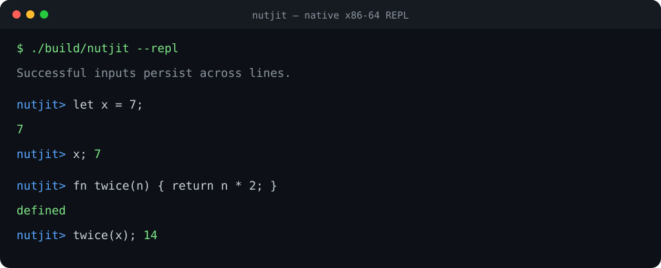

<h1 align="center">nutjit</h1>

<p align="center">
  <em>A small language with a JIT compiler that emits real x86-64 machine code
  into executable memory and jumps to it — no LLVM and no interpreter in the
  execution path.</em>
</p>

<p align="center">
  
  
  
  
  
</p>

<p align="center">
  
</p>

## What this is

Source passes through a hand-written lexer, a recursive-descent parser with
semantic validation, and nutjit's own x86-64 code generator. The emitted bytes
are copied into writable pages, those pages become read/execute-only, and the
host calls the generated function. The result really was computed by machine
code written at runtime.

```
source → lexer → parser + validation → AST → optimise → x86-64 bytes → W^X memory → CALL
```

## Measured result

One representative WSL2 run of `make bench`:

```
nutjit benchmark — fib(30), single-threaded medians
  3 interpreter runs, 21 compile samples, 21 JIT runs

  fib(30) = 832040  (all three back ends agree)

  implementation           run (ms) compile (ms)    speedup
  tree-walking interp       3507.69            -       1.0x
  nutjit (naive)               5.08        0.001     690.9x
  nutjit (optimised)           4.72        0.002     742.5x

  code size: naive 208 bytes, optimised 151 bytes
```

Timing varies by host, so the harness reports medians rather than presenting a
single sample as a constant. The optimized backend combines constant folding,
short immediate encodings, and a small `R10`/`R11` scratch-register allocator.
It spills when an expression exhausts the pool or must preserve a value across
a call.

```
$ ./build/nutjit --dump "2 + 3 * 4 - 1;"
b8 0d 00 00 00        # mov eax, 13 — one instruction
```

## The language

```text
fn fib(n) {
  if (n < 2) { return n; }
  return fib(n - 1) + fib(n - 2);
}

let total = 0;
let i = 0;
while (i < 10) {
  total = total + fib(i);
  i = i + 1;
}
total;
```

The language has signed 64-bit integers, `let`, assignment, arithmetic,
comparisons, `if`/`else`, `while`, and functions with up to six parameters and
recursion. The validator rejects unknown names, duplicate functions or
parameters, wrong call arity, top-level `return`, and variables that are not
definitely declared on every control-flow path.

## Why it is interesting

- The complete compiler pipeline is small enough to read.
- The backend hand-encodes REX prefixes, ModR/M bytes, signed division,
  comparisons, relative calls, and backpatched jumps.
- Generated functions follow the System V AMD64 ABI. Temporary expression
  spills are tracked so every generated `call` is correctly 16-byte aligned.
- JIT pages obey W^X: writable while filled, read/execute while called.
- A tree-walking interpreter provides an independent oracle. Every behavioral
  test must agree in both backends.
- Byte-exact golden tests also lock down important instruction encodings and
  call-alignment sequences.

See [the architecture guide](docs/02-architecture.md), [the code generator](docs/05-x86-codegen.md),
and [the calling-convention notes](docs/07-calling-convention.md).

## Quick start

```bash
sudo apt-get install -y g++ make

make run
make test                  # 63 differential cases + encoding goldens
make bench

./build/nutjit "let x = 5; x * 2;"
./build/nutjit --dump "1 + 2;"
./build/nutjit --interp "1 + 2;"
./build/nutjit --file program.nut
./build/nutjit --repl      # successful variables/functions persist
```

## Status

| # | Milestone | State |
|---|-----------|-------|
| 0 | Arithmetic JIT | ✅ done |
| 1 | Variables and stack frames | ✅ done |
| 2 | Comparisons and conditionals | ✅ done |
| 3 | Loops | ✅ done |
| 4 | Functions and recursion | ✅ done |
| 5 | Optimisation and interpreter oracle | ✅ done |
| 6 | REPL, benchmark, tests, CI, and releases | ✅ done |

The release build is warning-free. `make test` currently proves 63 behavioral
cases through both backends and six byte-level encoding properties.

## Inspect the output

```bash
./build/nutjit --dump "1 + 2;" 2>&1 |
  grep -E '^[0-9a-f ]+$' | xxd -r -p > /tmp/nutjit-code.bin
objdump -D -b binary -m i386:x86-64 /tmp/nutjit-code.bin
```

## Requirements

Linux or WSL2 on x86-64 with `g++` (C++17) and `make`. The JIT deliberately
targets the System V x86-64 ABI and uses `mmap`/`mprotect`.

## License

MIT — see [LICENSE](LICENSE).
